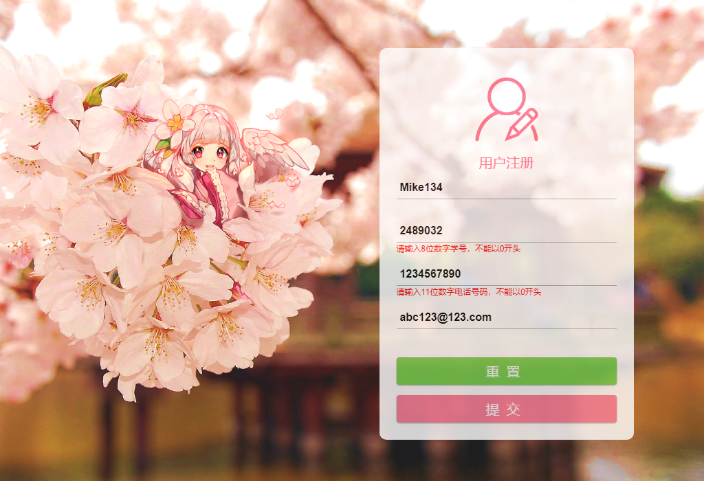
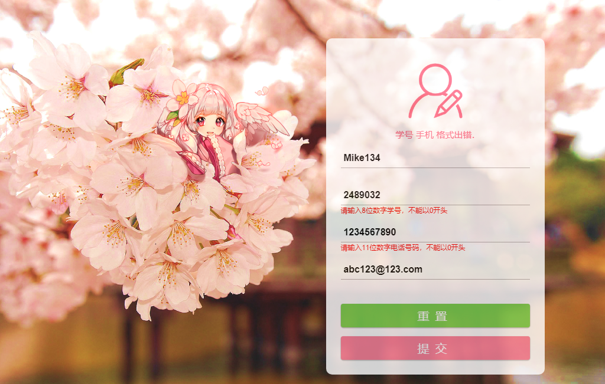
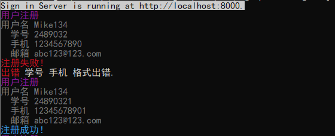

# Homework 7 - Sign up

## 简介

　　根据文档需求，利用`Node.js`库使用`javascript`设计一个具有简单服务器的本地网页注册系统，该系统具有基本的客户端与服务端的注册数据校验、注册成功页面跳转以及访问用户信息页面的功能。

## 样例输出

### 注册主页

　　在启动本地服务器后，可以在浏览器上通过`localhost:8000`进行访问。也可以直接指定用户名`localhost:8000?username=UserName`，结果输出主页会自动填上指定`UserName`信息(仍然可以重新修改)。填写信息后，可以选择**重置**，恢复初始信息状态(此处为清空所有已填信息)，或选择**提交**，提交注册信息。


### 出错提醒(信息校验)

#### 客户端

　　如果输入的数据不符合对应的文档需求，填写后会在对应输入栏下方显示提醒。



#### 服务端

　　因本次系统使用了较为简单的本地服务器(不会遇到网络阻塞延迟问题)，所以并没有为保证信息准确前提下而在客户端限制提交，所以直接提交后，如果注册信息依然有错误，或者信息内容已和已注册用户信息重复，会在页面显示出错信息。



### 用户信息页面

　　注册成功后，会自动跳转到用户信息页面，同时之后可以通过`localhost:8000?username=UserName`，重新访问该页面，比如下方页面在注册`Mike134`用户之后，可以通过`localhost:8000?username=Mike134`访问。


### 本地服务器控制台

　　本地控制台中，可以查看到注册失败与注册成功的信息记录。同时可以通过修改代码中的注释内容，来进一步查看网页的请求响应过程信息。



## 启动方法

### 安装Node.js库

　　该注册系统需要依赖`Node.js`库实现，所以如果没有安装过，请到[Node.js官网](https://nodejs.org/en/)([中文](http://nodejs.cn/))下载安装。本次系统使用的`Node.js`版本是`v10.13.0`(Windows系统)，个人未测试过旧版本的兼容情况，所以建议下载最新版本。

### 安装包插件

　　本次系统需要的插件有：

- [pug](https://pugjs.org/api/getting-started.html)([中文](https://pugjs.org/zh-cn/api/getting-started.html)) - HTML渲染引擎
- [colors](https://www.npmjs.com/package/colors) - 控制台样式渲染模块
- [malihu custom scrollbar](http://manos.malihu.gr/jquery-custom-content-scroller/) - jQuery滑动块样式渲染插件(**已内置**)

　　需要安装的插件为前两个，可以进入`signup`包直接使用`Node.js`内置的`npm`安装：

```powershell
> cd signup
> npm install
```

　　当然如果你之前已经安装了其中的某个插件，那么你只安装剩下的插件即可：

```powershell
> cd signup
> npm install pug --save
> npm install colors --save
```

### 启动本地服务器

　　命令行进入`signup`文件夹目录，然后执行`node signin.js`或者`npm run dev`即可启动服务器。然后就可以在浏览器上输入`localhost:8000`访问注册页面啦。

## 相关问题

1. 本次作业仅用于个人学习用途。
2. 背景图片来源于网络，而图标元素来源于[Iconfont-阿里巴巴矢量图标库](http://www.iconfont.cn/)的[惠农聚宝PC图标](http://www.iconfont.cn/collections/detail?spm=a313x.7781069.0.da5a778a4&cid=1142)。
3. 目前已发现系统存在的Bug为在提交错误信息后，注册页面会提示服务器返回的错误信息，同时已输入信息会保留，这时如果按下重置按钮，信息不会被清空，而是恢复为上次提交后的信息状态，这是由于`input reset`的机制问题。在后续将会进行修复解决。