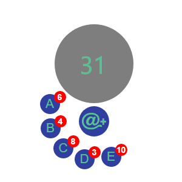

# Homework 8 - Asynchronous JavaScript

## 简介

　　在[Homework 3 - Ring Menu](https://reganfan.github.io/LearningWeb2.0/docs/Homework-3-Ring-Menu/index.html)的基础上，将菜单按钮变为A~E五个按钮，点击其中之一均可向本地Server发送随机数请求(**在1~3秒内，随机返回一个1~10之间的整数**)，并将获得的随机数显示在按钮右上角；当五个随机数均获取后，可以点击灰色大气泡(原信息框)获取五个随机数之和。同时可以根据不同要求，分别设计对应的程序实现自动点击按钮计算。

## 示例

　　以下为基本的效果图：



## 文件内容

```
|-- assets/
  |-- css/
    style.css                   // css样式文件
  |-- images/                   // 图标图片资源
|-- S1/                         // 基本实现(人工交互)
  index.html                    // 环形计算器主页(下同)
  index.js                      // 客户端js文件(下同)
|-- S2/                         // 仿真机器人(顺序点击A~E)
|-- S3/                         // 仿真机器人(并行点击5个按钮)
|-- S4/                         // 仿真机器人(按随机顺序点击按钮)
|-- S5/                         // 仿真机器人(独立行为，为按钮点击附加信息显示)
README.md                       // 本readme文档
server.js                       // 服务器js文件
```

### 说明

1. 文件夹S1~S5均包括有`index.html`和`index.js`文件，分别实现了不同的计算器功能效果。
2. 其中，S1为人工交互，只能允许用户逐个点击按钮获取随机数后，再点击大气泡获得求和结果。
3. S2是在S1的基础之上，点击`@`按钮将会自动执行内置的机器人程序，会按A~E的字母顺序依次点击按钮获取随机数，最后再点击大气泡获得求和结果。
4. S3也是在S1的基础之上，点击`@`按钮，内置的机器人程序会同时按下5个按钮，同时向本地Server获取随机数，并在所有随机数返回后，点击大气泡获得求和结果。
5. S4与S2类似，不过点击`@`按钮后，会先随机产生一个序列(共有`5!`或120种可能)，机器人会根据该序列依次按下按钮，最后按下大气泡获取求和结果。
6. S5则在S4的基础之上，添加了附加信息显示，同时点击按钮会随机产生异常(概率为50%，该异常会改变附加信息内容，但程序依然会正确获取随机数并计算)。A按钮正常显示信息为**这是个天大的秘密**，异常时显示**这并不是个天大的秘密**；B按钮正常显示**我不知道**，异常显示**我知道**；C按钮正常显示**你不知道**，异常显示**你知道**；D按钮正常显示**他不知道**，异常显示**他知道**；E按钮正常显示**才怪**，异常显示**才对**；大气泡正常显示**楼主异步调用战斗力感人，目测不超过`sum`**(5个随机数之和)，异常显示**楼主异步调用战斗力爆棚，预测超过了`sum`**。
7. S2~S5均能实现S1的功能，即内置的机器人程序并不会与人工点击产生冲突，但是同一时刻只能选择一种方式(用户一旦点击其中一个按钮获取随机数后，`@`按钮将灭活，无法启动机器人程序，除非重置计算器，否则需直到人工交互部分计算结束；同样，机器人程序启动后，用户点击按钮也不会产生效果)。

## 启动方法

### 安装Node.js

　　服务器程序需要利用到`Node.js`库，如果未安装，请到[官网](https://nodejs.org/en/)([中文](http://nodejs.cn/))下载最新版本。个人本次用到的`Node.js`版本为`v10.13.0`(Windows系统)。

### 启动本地服务器

　　命令行进入`server.js`文件所在目录，然后执行：

```powershell
> node server.js
```

### 浏览器访问

　　S1~S5的访问地址如下：

```
S1: http://localhost:3000/S1/index.html
S2: http://localhost:3000/S2/index.html
S3: http://localhost:3000/S3/index.html
S4: http://localhost:3000/S4/index.html
S5: http://localhost:3000/S5/index.html
```

## 其他相关问题说明

1. 建议使用Google Chrome访问页面，可以使得效果最优。Firefox、Edge以及IE等浏览器可能会出现动画效果错位问题，但并不影响交互功能。
2. S3使用了`Promise`，其他均只使用了简单的回调函数，同时个人已在S3的`index.html`中添加了`Promise`库代码的CDN，可以放心在IE浏览器启动。
3. S5中信息会在成功获取随机数后显示在环形计算器上方，同时为了方便显示所有信息，从最后一个随机数获取成功到点击大气泡求和之间设置了延迟，所以会有明显的大气泡从蓝变灰的过渡。
4. 强烈建议打开浏览器的控制台来进行评阅，尤其是S5，会提供相当多有关的执行信息，希望能因此帮助到你。
5. S5中，A~E按钮以及大气泡均有独立的事件处理器，个人通过传递`options`参数以及`callback`函数(`optionsChange`)来实现各个处理器在异步调用时之间的信息沟通，同时用到了`errHandler`函数作为异常处理的`errCallback`，所以有可能不太符合异常处理的部分要求。
6. 一般情况下，计算器均会对用户的一些异常操作提供相应的处理或限制，包括在随机数信息未到达时就重置计算器、机器人程序未执行完成就重置或在请求执行时，用户随意点击按钮。另外，目前已发现5个计算器均存在有同一个bug，即如果在展开计算器后，连续重复点击同一个按钮，展开有可能会重置，这是`hover`事件和点击事件之间的冲突造成的，现在仍未能找到合适的解决方法。