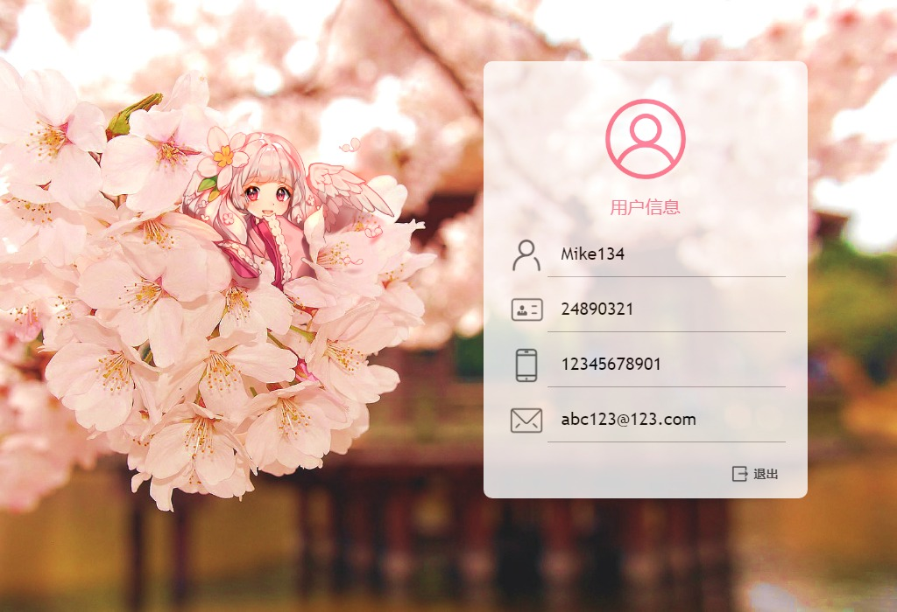
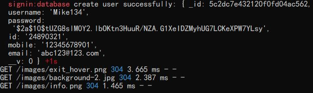
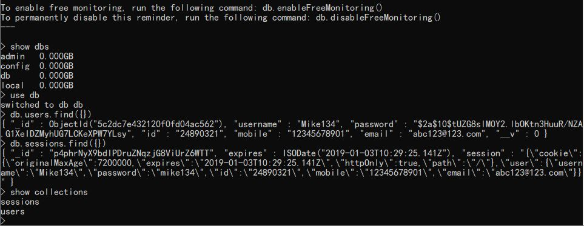
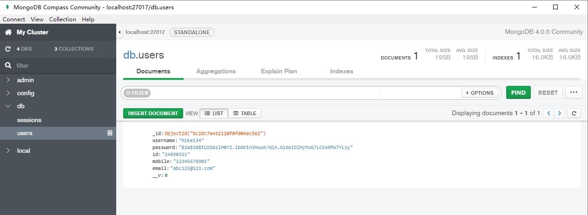

# Homework 9 - Sign in

## 简介

　　在[Homework 7 - Sign up](https://github.com/ReganFan/LearningWeb2.0/tree/gh-pages/docs/Homework-7-Sign-up)的基础上，新添加一个登录子系统，使其具备用户注册、登录、访问和退出等功能，同时将整个系统转变成一个[Express](https://expressjs.com/zh-cn/)应用，并使用[MongoDB](https://www.mongodb.com/)对数据持久化。系统设计还需要实现登录保持和信息安全，用户登录状态不会随浏览器关闭而直接消失，且用户密码在进行适当加密之后再存储在数据库内。

## 样例输出

### 登录页面

#### 主页

　　浏览器访问`http://localhost:8000`进入，若已有用户账号，输入用户名和密码，点击登录即可；若未有账号，点击右下角`注册`按钮进入注册页面。

　　如果已有账号用户，在未登录前直接访问`http://localhost:8000?username=账号用户名`，页面会提示`请先登录`。


#### 登录失败

　　登录时，客户端会先校验用户名与密码格式的合法性，只有合法的用户名和密码才能够正确提交；服务器在收到登录表单后再进行校验，如果用户名不存在或密码错误会返回提示，如下：


### 注册页面

　　注册页面与`Homework 7 - Sign up`类似，不过在该系统，只有所有信息格式均合法，才会提交注册信息成功；服务器收到表单信息后会再进行校验，检查信息重复性，若有信息重复，返回提示。

　　注册框的左上角有返回按钮，可返回登录页面。另外，如果直接访问`http://localhost:8000?username=新账号用户名`也能直接进入注册页面。


### 用户信息页面

　　新用户注册成功，会自动跳转到用户信息页面；旧用户登录成功，也会自动跳转到用户信息页面；同时，如果已登录用户未退出登录就关掉浏览器，一段时间内再次使用该浏览器访问`http://localhost:8000`时，也会自动跳转到该用户信息页面。

　　已登录用户，如果访问`http://localhost:8000?username=非本人账号用户名`，页面会自动跳转到该用户账号的信息页面，并提示`注意：只能够访问自己的数据！`。

　　信息框右下角有`退出`按钮，可以退出登录。



### 控制台截图

　　如下为注册成功后，数据库返回的创建用户成功信息：



## 启动方法

### 安装依赖库

　　本次应用需要使用到`Node.js`库、`Express`框架以及数据库`MongoDB`，因此在可以成功运行之前，需要进行必要的应用下载安装准备。

1. 安装`Node.js`，前往[官网](http://nodejs.cn/)下载最新版本。个人使用的版本为`v10.13.0`。
2. 根据自己个人系统，前往[下载](https://www.mongodb.com/download-center/community)MongoDB Server到本地。本人使用的操作系统是`Windows 64-bit x64`，下载的是MongoDB社区版Server，版本为`4.0.5(current release)`。
3. 根据自己个人系统，按照[官方文档说明](https://docs.mongodb.com/manual/administration/install-community/)(或国内的[菜鸟教程说明](http://www.runoob.com/mongodb/mongodb-tutorial.html))，安装Server程序。个人安装的是`Windows`版本，且未作为`Windows services`安装。
4. 命令行进入目录，`> cd signin`，进行包安装`> npm install`。

### 启动MongoDB

1. 根据上述的MongoDB说明文档，结合个人系统，启动本地的MongoDB Server，同时建议设置`dbpath`为本次项目目录下的`data\db`文件夹作为数据库数据存储(也可以自行选择合适的磁盘路径存储)。如本人的`Windows`系统下，用管理员权限使用`CMD`进入MongoDB应用目录`> cd 安装目录\bin`，执行`> mongod --dbpath="项目文件目录\signin\data\db"`启动数据库服务器。

### 启动本地服务器

1. `Windows`下，新打开一个`cmd`，然后启动项目应用。

   ```powershell
   > cd signin
   > set DEBUG=signin:* & npm start  # 以下两种方式选其一启动
   > npm start                       # 和上述指令选其一启动
   ```

   `Linux`或`MacOS`下，打开一个新的`shell`，启动。

   ```shell
   $ cd signin
   $ DEBUG=signin:* npm start     # 以下两种方式选其一启动
   $ npm start                    # 和上述指令选其一启动
   ```

   两种系统均建议使用`DEBUG`方式启动，如此能够在控制台看到服务器和数据库相关的运行信息。

2. 打开浏览器，访问`http://localhost:8000`即可进入登录页面。

## 相关问题

1. 本次作业仅用于个人学习用途，同时关于文件结构内容说明，请看[说明](https://github.com/ReganFan/LearningWeb2.0/tree/gh-pages/docs/Homework-9-Sign-in/signin)。
2. 应用存储的数据库名称为`db`，用于存储Session信息以及用户数据。它包含两个`collections`，分别为`sessions`和`users`，前者存放用户登录的状态Session信息，后者则存放用户数据信息。查看数据库方式有两种，可以使用MongoDB Server安装目录下的`mongo`程序查看：或另外下载可视化工具`MongoDB Compass`查看：
3. 用户密码使用的是简单的[bcrypt](https://zh.wikipedia.org/wiki/Bcrypt)加密，且只在服务器端设置了加密处理(在注册时)，即用户注册和登录时，客户端均是直接发送密码明文给服务器端。
4. 应用的背景图片来源于网络，图标元素则来源于[Iconfont](https://www.iconfont.cn/)图标库。
5. 目前应用已发现存在的Bug有：1. 用户如果在输入信息有误、错误提示出现的前提下，连续点击登录页面的`登录`按钮或注册页面的`注册`按钮，错误的输入项会连续重复地闪烁而非固定闪烁提醒一次；2. 同一用户目前可以在多个客户端重复登录；3. 与`Homework 7 - Sign up`同样存在的，在提交错误信息后，注册页面会提示服务器返回的错误信息，同时已输入信息会保留，这时如果按下重置按钮，信息不会被清空，而是恢复为上次提交后的信息状态。这些Bug并不会影响系统正常的运行使用，后续会进行适当修复解决。